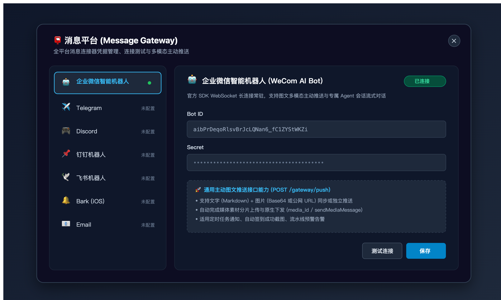

# dsh-message-gateway

[中文](README.md) · [English](README.en.md)



Un plugin de pasarela de mensajería para la GUI web de DSH: una entrada "Plataformas de mensajería" debajo del botón "Nueva sesión" abre un gestor a pantalla completa para conectores de mensajería multiplataforma — guardado de credenciales, pruebas de conexión, monitoreo de estado — más un puente persistente integrado para el bot de IA de WeCom: los mensajes externos impulsan al asistente de DSH a través de una sesión de agente dedicada, y las respuestas se transmiten token a token. También proporciona una API universal de push proactivo que admite texto Markdown e imágenes nativas.

## Características

- **Entrada en la barra lateral**: un botón "📮 Plataformas de mensajería" debajo de "Nueva sesión" abre el gestor a pantalla completa (cierre con ESC o haciendo clic en el fondo)
- **Conectores multiplataforma**: Telegram / Discord / Bot de QQ / WeCom / Bot de IA de WeCom / WeChat (pasarela Wechaty externa) / Cuenta oficial de WeChat / WhatsApp / Email / DingTalk / Feishu / Bark / ServerChan / Webhooks
  - **Bot de IA de WeCom**: rellene `botId + secret` para conexión WebSocket persistente; admite respuestas en streaming, subida de medios y **envío proactivo de imágenes/archivos**
  - **Bot de Telegram**: guarde un Bot Token para sondeo largo, admite streaming y `sendPhoto` para **envío proactivo de imágenes**
  - **Bot de Discord**: guarde un Bot Token para conectar vía Gateway, admite canales/DMs y adjuntos `files` para **envío proactivo de imágenes**
  - **Bot de DingTalk**: configure Webhook y Secret opcional; admite Markdown y URL de imagen pública
  - **Bot de Feishu / Lark**: configure Webhook y Secret opcional para entrega de mensajes y tarjetas
  - **Bark (iOS)**: ingrese la Device Key para notificaciones instantáneas con banners de imágenes ricas (URL pública)
  - **ServerChan**: configure SendKey para notificaciones a WeChat con URLs de imágenes en Markdown
  - **Bot de QQ**: guarde appId + secret para conectar a la plataforma abierta; respuestas pasivas + edición en streaming
  - **App de WeCom**: rellene CorpID/AgentID/Secret más Token/EncodingAESKey de callback
  - **Cuenta oficial de WeChat**: rellene AppID/Secret más Token de callback
  - **WhatsApp**: rellene Token + Phone Number ID para webhooks de WhatsApp
  - **Email**: rellene IMAP (993/143) + SMTP (465/587/25) para correos en hilos
- **Canal de push proactivo universal**: `POST /gateway/push` (para tareas programadas, scripts de automatización y pipelines):
  - Cuerpo de la petición:
    - `platform`: plataforma destino (`wecom-aibot` / `telegram` / `discord` / `dingtalk` / `feishu` / `bark` / `serverchan` / `email`)
    - `target`: destino (userid o grupo para `wecom-aibot`; chatId numérico para `telegram`; channelId para `discord`; deviceKey para `bark`, etc.)
    - `content`: texto opcional (admite Markdown)
    - `title`: título opcional (asunto de correo o prefijo de notificación)
    - `image`: imagen opcional (datos en **Base64** o URL accesible `http(s)://`)
    - `filename`: nombre de archivo opcional (por defecto `image.png`)
  - Destacados:
    - El texto y la imagen se pueden enviar juntos o por separado
    - `wecom-aibot`, `telegram` y `discord` admiten la carga directa de buffers binarios locales
    - `bark`, `dingtalk` y `serverchan` se adaptan automáticamente al modo de URL pública
- **Gestión de credenciales**: el texto plano se guarda solo en `~/.dsh/gateway.json` (modo 600, escritura atómica); `/gateway/list` nunca devuelve credenciales, solo un marcador `configured`
- **Redacción de secretos**: el contenido de los mensajes escrito en registros / consola se enmascara automáticamente ante posibles secretos
- **Pruebas de conexión**: comprobaciones reales por plataforma — Telegram/Discord vía Bot API, QQ vía access_token, WeCom vía gettoken, cuenta oficial vía cgi-bin/token, WhatsApp vía Graph API, Email vía banner TCP de IMAP, Bot de IA de WeCom vía la conexión larga del SDK oficial
- **Puente persistente del Bot de IA de WeCom**: conexión larga WebSocket del SDK oficial con reconexión por retroceso exponencial
  - **Acumulación de flujo multietapa sin sobrescritura**: en tareas complejas de múltiples pasos, las conclusiones y pensamientos anteriores se conservan limpiamente sin ser reemplazados; las pausas muestran un indicador de estado dinámico (`⏳ Procesando, por favor espere…`) que se retira al finalizar
  - **Cierre ordenado y reconexión inmediata**: captura las señales de apagado del sistema para cerrar las conexiones formalmente, eliminando los bloqueos por espera de 30 segundos y reconectando en 1–2 segundos
  - **Eliminación de menciones @ en grupos**
  - **Comandos de barra**: `/help` / `/time` / `/status` / `/stats`
  - **Mensaje de bienvenida opcional**
  - **Canal de envío proactivo**: `POST /gateway/send`
  - **Reglas de enrutado de mensajes** (`routes`)
  - **Herramienta de push para agentes** (`send_chat_message`): registra automáticamente una herramienta para que los agentes envíen resúmenes, resultados o alertas (incluyendo imágenes y capturas de pantalla)
- **Endpoint de recepción de webhooks**: `POST /gateway/webhook/in`
- **Multilingüe**: chino / inglés / español, siguiendo el idioma de la interfaz web de DSH
- Tema claro / oscuro siguiendo la GUI web de DSH

## Uso

1. Abra DSH Web (`dsh web`) y haga clic en el botón "Plataformas de mensajería" de la barra lateral
2. Elija una plataforma a la izquierda y complete las credenciales a la derecha
3. Haga clic en **Guardar**: las credenciales se persisten y se ejecuta automáticamente una prueba de conexión, actualizando el estado al instante
4. Haga clic en **Probar conexión**: prueba los valores actuales del formulario sin guardarlos
5. Guardar `botId + secret` del Bot de IA de WeCom establece el puente persistente de inmediato; eliminar la configuración lo desconecta

## Instalación

```sh
# Desde npm (plugin genérico, utilizable por cualquier usuario de DSH)
dsh plugin --profile web add dsh-message-gateway
```

Reinicie `dsh web`: el botón "Plataformas de mensajería" aparece debajo de "Nueva sesión" en la barra lateral. Abra la página, elija una plataforma, complete las credenciales y haga clic en **Guardar** — para el Bot de IA de WeCom, guardar `botId + secret` establece el puente persistente de inmediato y puede chatear con el bot en WeCom al momento (igual que en la web: sesiones por chat + compresión automática de contexto).

## Configuración

Todas las opciones tienen valores por defecto y el plugin funciona de inmediato; ajústelas vía `dsh plugin config` o el archivo de configuración del perfil:

| Opción | Tipo | Por defecto | Descripción |
| --- | --- | --- | --- |
| `botLocale` | `zh` \| `en` | `zh` | Idioma de las respuestas del bot |
| `maxChatAgents` | number | `40` | Máximo de sesiones de chat por bot; se elimina la más antigua al superarlo |
| `autoStartWecom` | boolean | `true` | Conectar automáticamente el Bot de IA de WeCom con las credenciales guardadas al iniciar |
| `groupReply` | boolean | `true` | Responder mensajes de grupo (false = solo chats individuales) |

## Documentación

- [Arquitectura y guía de extensión](docs/architecture.md) (cómo añadir un conector de plataforma)
- [Contrato del endpoint de recepción de webhooks](docs/webhooks.md)
- [Contrato de la pasarela HTTP de WeChat (Wechaty)](docs/wechaty-gateway.md)

## Arquitectura

- **Mitad host** (`lib/index.js`): rutas `/gateway/*` (list / save / delete / test / wechat-status) + `BridgeManager` (inyección de sesión de agente y sondeo del flujo de eventos) + `WecomBridge` (ciclo de vida de la conexión larga del SDK) + `gateway-store` (persistencia de credenciales)
- **Mitad cliente** (`lib/client.js`): montaje del botón de la barra lateral + gestor a pantalla completa (React, cargado vía el cierre de `__ModuleLoader__`)

## Comentarios

¿Encontró un error o tiene una sugerencia? Abra un issue en [GitHub Issues](https://github.com/a792883583/dsh-message-gateway/issues) — sus comentarios nos ayudan a mejorar el plugin.

## Licencia

MIT